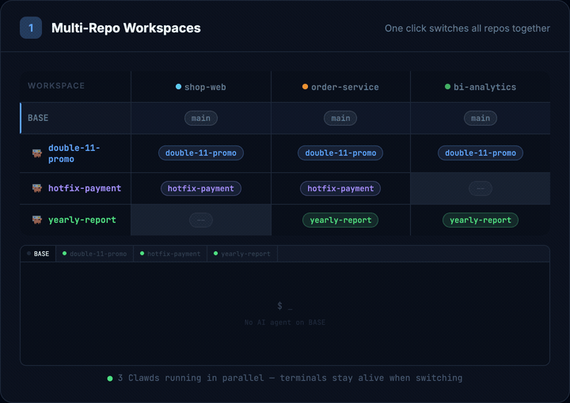
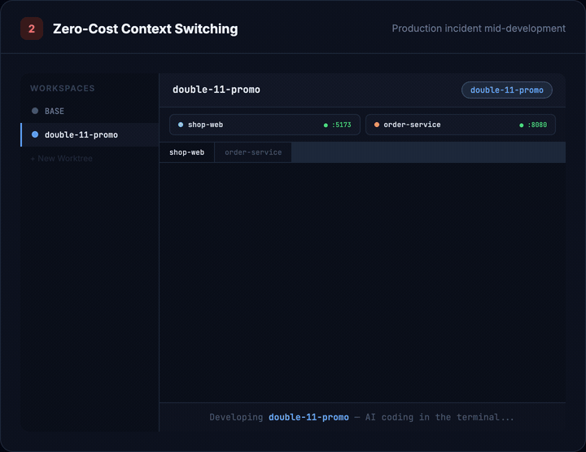
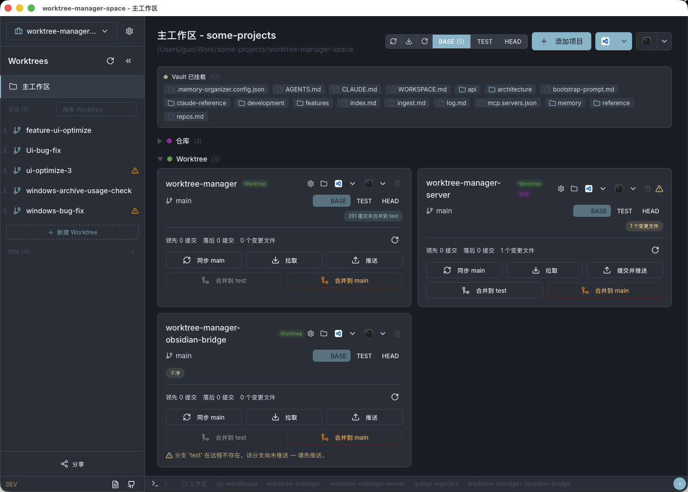
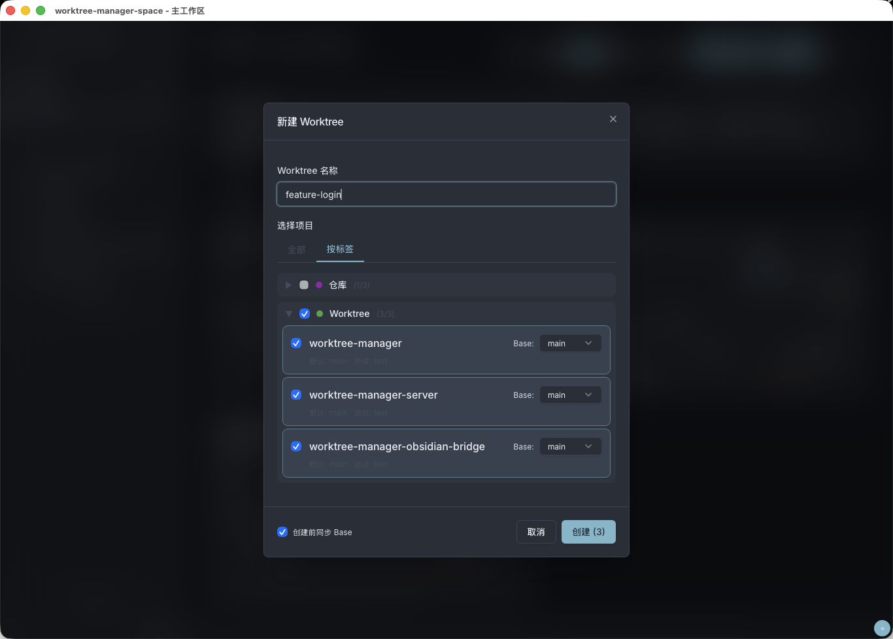
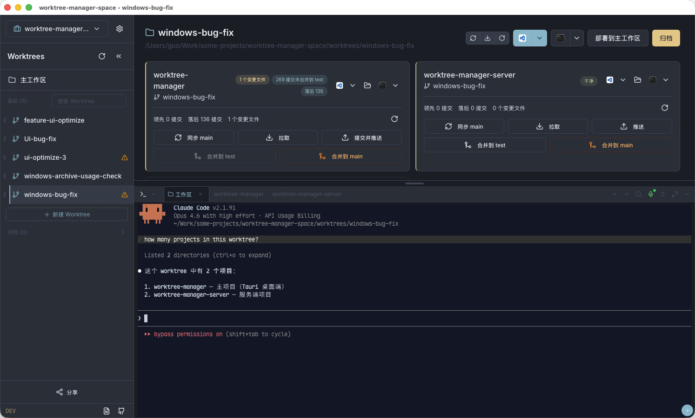
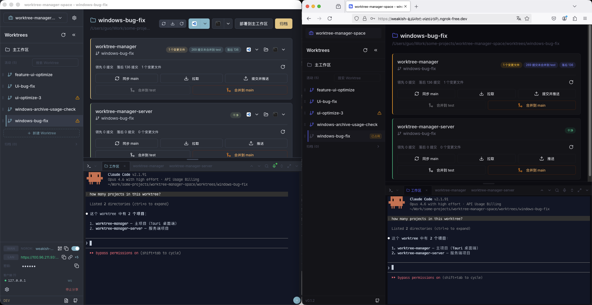
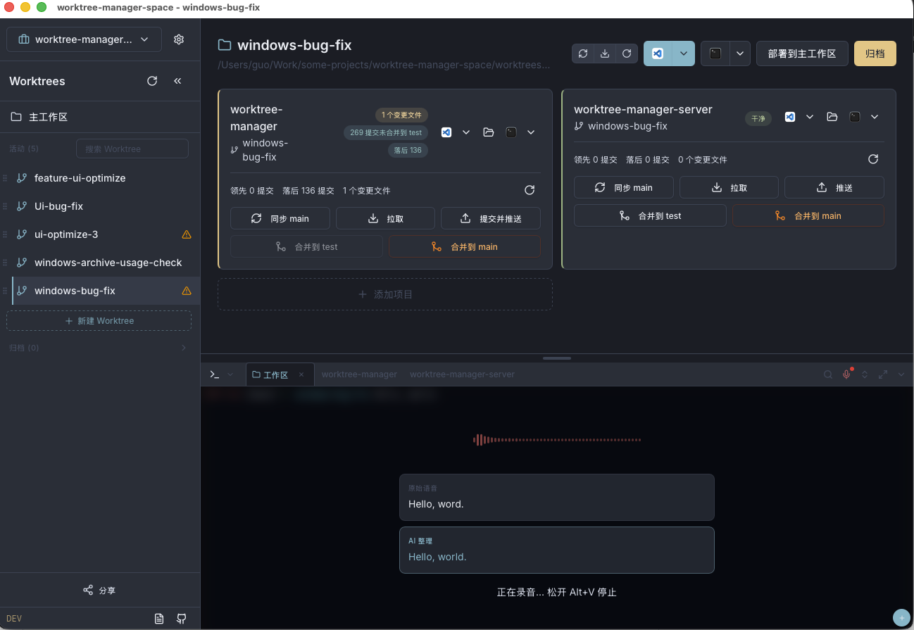

<div align="center">


# Worktree Manager

**The missing GUI for Git Worktrees.**

Work on multiple branches simultaneously, across multiple repos, without `stash`, `clone`, or context-switching pain.

[](LICENSE)
[](https://github.com/guoyongchang/worktree-manager/releases)
[](https://github.com/guoyongchang/worktree-manager/releases)
[](https://tauri.app/)

<p align="center">
  <a href="#-quick-start">Quick Start</a> •
  <a href="#-features">Features</a> •
  <a href="#-screenshots">Screenshots</a> •
  <a href="#-faq">FAQ</a> •
  <a href="README.zh-CN.md">中文</a>
</p>

[**Download**](https://github.com/guoyongchang/worktree-manager/releases) |
[Documentation](https://guoyongchang.github.io/worktree-manager/) |
[MCP Integration](docs/MCP.md)

</div>

---

## Why Worktree Manager?

You're deep in a feature branch. Fifteen files changed. Dev server running. Then Slack pings: **production is down**.

**Without Worktree Manager** — `git stash` → switch branch → `npm install` → wait for rebuild → fix → switch back → `git stash pop` → pray for no conflicts → restart dev server. **15 minutes minimum.**

**With Worktree Manager** — Click "New Worktree", type `hotfix-payment`, done. Your feature branch keeps running. Dependencies are shared via symlink — instant setup. Fix, push, archive. **30 seconds.**

### Multi-Repo Workspaces & Parallel AI Development

Group related repos into a **Workspace**. Creating a Worktree creates a `git worktree` across all linked projects at once. Each Worktree gets its own terminal — run Claude Code, Codex, or Cursor in parallel across different branches without conflicts.

<p align="center">

</p>

### Zero-Cost Context Switching

P0 alert mid-development? Create a `hotfix-payment` Worktree → AI-assisted fix → merge to main → archive → switch back. **Uncommitted code, terminal output, dev servers — everything stays intact.**

<p align="center">

</p>

---

## 📸 Screenshots

| Main Interface | Create Worktree |
| :---: | :---: |
|  |  |

| Terminal & AI Coding | Browser Remote Access |
| :---: | :---: |
|  |  |

| Voice Input & AI Refine |
| :---: |
|  |

---

## 🚀 Quick Start

### Download

| Platform | Download |
|----------|----------|
| macOS    | [`.dmg`](https://github.com/guoyongchang/worktree-manager/releases/latest) |
| Windows  | [`-setup.exe`](https://github.com/guoyongchang/worktree-manager/releases/latest) |
| Linux    | [`.AppImage` / `.deb`](https://github.com/guoyongchang/worktree-manager/releases/latest) |

> **Only requirement: Git 2.0+.** No Node.js or Rust needed at runtime.

### Get Started in 3 Steps

1. **Create a Workspace** — Point to your project directory or create a new one
2. **Add Projects** — Import repos via GitHub shorthand (`owner/repo`), SSH, or HTTPS
3. **Create Worktrees** — Click "+", name your branch, select projects, go

That's it. Your worktree is ready with all dependencies symlinked and terminals pre-configured.

---

## ✨ Features

### Core

| Feature | Description |
|---------|-------------|
| 🌿 **Parallel Branches** | Work on multiple branches at the same time in isolated directories, sharing the same `.git` data |
| 📦 **Multi-Repo Workspaces** | Group related repos (frontend + backend + shared libs) — create a worktree and all repos switch together |
| 🔗 **Smart Symlinks** | Auto-link `node_modules`, `.next`, `vendor`, `target` etc. Zero disk waste, zero reinstall |
| 🏷️ **Tag Organization** | Tag projects by team, domain, or stack. Filter and batch-select when creating worktrees |

### Git Operations

| Feature | Description |
|---------|-------------|
| 🔄 **One-Click Operations** | Sync, merge to test, pull, push — all from the UI with real-time diff stats |
| 📊 **Branch Insights** | See how many commits you're ahead/behind at a glance |
| ⚡ **Batch Actions** | Trigger operations across all projects in a worktree simultaneously |
| 📝 **AI Commit Messages** | Generate commit messages with Qwen AI (optional) |

### Terminal & Remote

| Feature | Description |
|---------|-------------|
| 💻 **Built-in Terminal** | Full terminal emulator (xterm.js + PTY) with shell integration and search |
| 🎤 **Voice Input** | Speak to type in terminal — powered by Dashscope ASR with AI text refinement |
| 🌐 **Browser Remote** | Share your workspace over the network with password protection |
| 🔒 **ngrok Tunneling** | Optional public access via ngrok — no port forwarding needed |

### Integrations

| Feature | Description |
|---------|-------------|
| 🖥️ **IDE Integration** | One-click open in VS Code, Cursor, or IntelliJ IDEA |
| 🤖 **AI-Ready (MCP)** | Built-in [MCP server](docs/MCP.md) — let Claude Code, Cursor, or Codex manage worktrees via natural language |
| 📁 **Safe Archiving** | Pre-archive checks catch uncommitted changes and running processes. Restore anytime |

---

## ❓ FAQ

<details>
<summary><strong>What is a Git worktree?</strong></summary>

A Git worktree lets you check out multiple branches into separate directories while sharing a single `.git` database. Unlike cloning, worktrees share history, refs, and hooks — no extra disk space for repository data. [Learn more](https://git-scm.com/docs/git-worktree)

</details>

<details>
<summary><strong>How does the symlink feature work?</strong></summary>

When creating a worktree, Worktree Manager automatically creates symlinks for directories you specify (e.g., `node_modules`, `.next`, `target`). These point to the main project's directories, so you never need to reinstall dependencies. You can configure which folders to link per project.

</details>

<details>
<summary><strong>Can I use it with a single repo?</strong></summary>

Absolutely. While multi-repo workspaces are a key feature, Worktree Manager works perfectly with a single repository too.

</details>

<details>
<summary><strong>Does browser remote access require installing anything on the remote machine?</strong></summary>

No. The remote machine only needs a modern browser. Everything runs through the web interface — terminal, file browsing, git operations, worktree management.

</details>

<details>
<summary><strong>Is my data safe when sharing via browser?</strong></summary>

Yes. Browser access is password-protected with challenge-response authentication (no plaintext passwords over the wire). You can also limit access to LAN-only or use ngrok for secure tunneling.

</details>

<details>
<summary><strong>What does the MCP integration do?</strong></summary>

The built-in [Model Context Protocol](docs/MCP.md) server lets AI coding assistants (Claude Code, Cursor, Codex) create worktrees, check status, and run git operations through natural language — without leaving your AI chat. See [MCP docs](docs/MCP.md) for setup.

</details>

---

## 📂 How It Works

<details>
<summary>Workspace directory structure</summary>

```
workspace/
├── .worktree-manager.json        # Workspace config
├── projects/                     # Main repos (base branches)
│   ├── frontend/
│   └── backend/
└── worktrees/                    # Your worktrees
    ├── feature-checkout-v2/
    │   ├── projects/
    │   │   ├── frontend/         # ← git worktree (own branch)
    │   │   │   └── node_modules  # ← symlink to main
    │   │   └── backend/
    │   ├── .claude -> ../../.claude       # Shared files
    │   └── CLAUDE.md -> ../../CLAUDE.md
    └── hotfix-payment/
        └── ...
```

Shared items (`.claude`, `CLAUDE.md`, config files) are automatically symlinked across all worktrees so AI assistants and tooling configs stay in sync.

</details>

<details>
<summary>Workspace config example (<code>.worktree-manager.json</code>)</summary>

```jsonc
{
  "name": "My Project",
  "worktrees_dir": "worktrees",
  "linked_workspace_items": [".claude", "CLAUDE.md"],
  "tags": [
    { "id": "fe", "name": "Frontend", "color": "#3B82F6" },
    { "id": "be", "name": "Backend", "color": "#10B981" }
  ],
  "projects": [
    {
      "name": "web-app",
      "base_branch": "main",
      "test_branch": "test",
      "merge_strategy": "merge",
      "linked_folders": ["node_modules", ".next"],
      "tags": ["fe"]
    }
  ]
}
```

</details>

<details>
<summary>Adding projects — supported formats</summary>

| Format | Example |
|--------|---------|
| GitHub shorthand | `facebook/react` |
| SSH | `git@github.com:facebook/react.git` |
| SSH (custom port) | `ssh://git@gitlab.com:1022/org/repo.git` |
| HTTPS | `https://github.com/facebook/react.git` |

</details>

---

## 🔧 Building from Source

<details>
<summary>For contributors and developers</summary>

**Prerequisites:** Node.js 20+, Rust 1.70+ ([install](https://rustup.rs)), Git 2.0+

```bash
git clone https://github.com/guoyongchang/worktree-manager.git
cd worktree-manager
npm install

# Development
npm run build && npm run tauri dev

# Production build
npm run tauri build

# Verify command contracts (IPC ↔ HTTP sync)
npm run contracts
```

**Tech Stack:** Tauri 2 · React 19 · TypeScript 5 · Tailwind CSS 4 · Rust (axum, git2, tokio) · xterm.js

See [TESTING.md](docs/TESTING.md) for the testing strategy.

</details>

---

## Contributing

Contributions are welcome! Please open an issue first to discuss what you'd like to change.

## License

[MIT](LICENSE)

---

<div align="center">

**If Worktree Manager saves you time, consider giving it a ⭐!**

[Report Bug](https://github.com/guoyongchang/worktree-manager/issues) ·
[Request Feature](https://github.com/guoyongchang/worktree-manager/issues) ·
[Documentation](https://guoyongchang.github.io/worktree-manager/)

</div>
